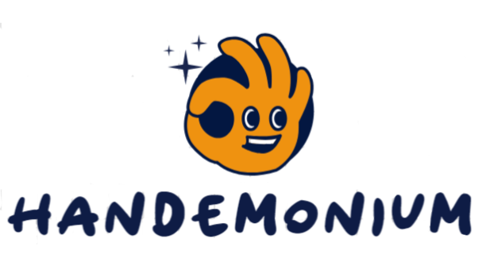

<h3 align="center">

<br>
Overall Winning submission for IC Hack 24 - Best EdTech Solution sponsored by Marshall Wace
<br>
<a href="https://devpost.com/software/handemonium">Dev Post Link</a>
</h3>


## Try it yourself
Clone the repository then:

```bash
# Using the official GitHub CLI
$ gh repo clone suhas-arun/handemonium

# or using git
$ git clone https://github.com/suhas-arun/handemonium.git
```

### Requirements

- [Node.js](https://nodejs.org/en/download/)
- [Docker](https://docs.docker.com/install/)
- [Python 3.10 (although will work with other versions)](https://www.python.org/downloads/release/python-3100/)

### Add yourself to facial recognition
The backend currently uses a static 'student' database so you will need to add your headshot to ```./backend/data/headshots``` and add your name and path to photo to ```./backend/data/students.csv```. 

Then navigate to ```./frontend/handemonium/src/GameState.ts``` and add your name to the GameStat users like: ```['name', 0]```

### Run the web server locally
You can run our containerised web server locally by using our 'dev' docker-compose.yml or using node.js and python locally (required libraries are stored with requirements.txt).

```bash
cd dev/ \
docker-compose up --build -d
```

or 

```bash 
cd backend 
uvicorn main:app
cd ..
cd frontend 
npm run build
npm run start
```

Then navigate to http://localhost:3000

## Considerations
Our image analysis is computationally expensive and runs best on a GPU. It will run on a CPU but quite slowly.
